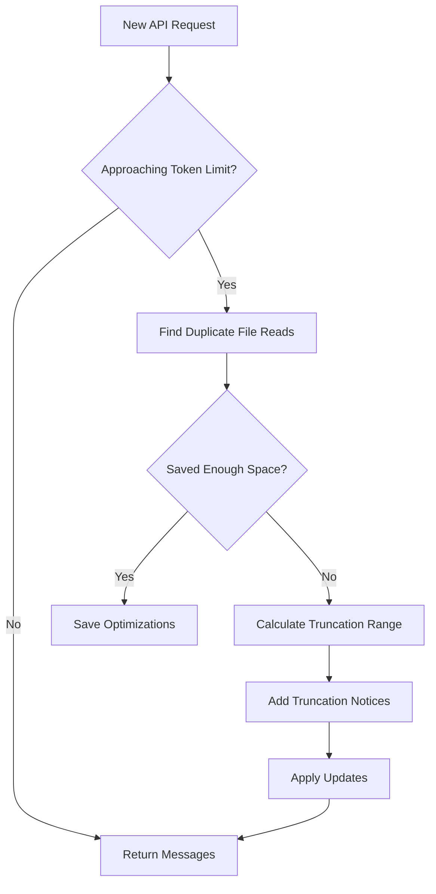

# Context Management System

## 📚 Overview

The Context Management System is responsible for optimizing conversation context to stay within API token limits while preserving conversation quality. It uses a modular architecture where each component has a single, clear responsibility.

## 🎯 Core Objectives

1. **Track Context Changes**: Maintain a history of all modifications to conversation messages
2. **Optimize Space**: Remove duplicate file reads to save tokens
3. **Smart Truncation**: Remove older messages when necessary, keeping conversation structure
4. **Preserve Quality**: Apply optimizations before resorting to truncation
5. **Support Checkpoints**: Enable restoration to previous conversation states

## 🏗️ Architecture

### Module Overview

```
context_manager.ts              # Orchestrator - coordinates all modules
├── context_types.ts           # Shared type definitions
├── context_history_storage.ts # Disk I/O operations
├── truncation_calculator.ts   # Truncation range calculation
├── file_read_optimizer.ts     # Duplicate file detection & replacement
├── context_update_applicator.ts # Applies updates to messages
└── optimization_metrics.ts    # Impact measurement
```

### Separation of Concerns

Each module has a focused responsibility:

| Module | Responsibility | Key Methods |
|--------|---------------|-------------|
| **ContextManager** | Orchestrates the entire system | `getNewContextMessagesAndMetadata()` |
| **ContextHistoryStorage** | Persists data to/from disk | `loadFromDisk()`, `saveToDisk()` |
| **TruncationCalculator** | Calculates what to remove | `calculateRange()` |
| **FileReadOptimizer** | Finds & replaces duplicates | `findAndSaveDuplicates()` |
| **ContextUpdateApplicator** | Applies updates to messages | `applyUpdates()` |
| **OptimizationMetrics** | Measures optimization impact | `calculateImpact()` |

## 🔄 Workflow

### 1. Normal Operation



### 2. Context Update Flow

```
1. ContextManager receives messages
2. FileReadOptimizer finds duplicates
3. ContextManager stores updates in contextHistory
4. ContextUpdateApplicator applies updates to messages
5. ContextHistoryStorage persists to disk
```

### 3. Truncation Strategy

The system always keeps the first user-assistant message pair and truncates from the middle:

```
[Keep] Message 0 (User)
[Keep] Message 1 (Assistant)
[Delete Range] Messages 2-N (based on strategy)
[Keep] Messages N+1 onwards
```

**Strategies:**
- `none`: Remove all except first pair
- `lastTwo`: Keep first pair + last user-assistant pair
- `half`: Remove half of the messages
- `quarter`: Remove 3/4 of the messages

## 📊 Data Structures

### Context History Map

```typescript
Map<messageIndex, [editType, Map<blockIndex, ContextUpdate[]>]>
```

**Structure:**
- **Outer Map**: Message index → Message updates
- **Inner Tuple**: [EditType, Inner Map]
  - `EditType`: Type of edit (READ_FILE_TOOL, FILE_MENTION, etc.)
  - **Inner Map**: Block index → Array of updates
- **Context Update**: `[timestamp, updateType, content, metadata]`

### Example

```typescript
contextHistory = Map {
  1 => [0, Map {
    0 => [[1234567890, "text", ["[NOTE] Previous context truncated..."], []]]
  }],
  5 => [2, Map {
    1 => [[1234567891, "text", ["<file_content>...DUPLICATE CONTENT NOTICE...</file_content>"], []]]
  }]
}
```

## 🔍 Key Concepts

### Edit Types

```typescript
enum EditType {
  UNDEFINED = 0,        // Default/unspecified
  NO_FILE_READ = 1,     // No file content
  READ_FILE_TOOL = 2,   // read_file tool call
  ALTER_FILE_TOOL = 3,  // write_to_file/replace_in_file
  FILE_MENTION = 4,     // File mention in user message
}
```

### Duplicate File Read Detection

The system tracks file reads from three sources:

1. **read_file tool**: Always contains full file content
2. **write_to_file/replace_in_file tools**: Include final_file_content with full file
3. **File mentions**: `<file_content path="...">` tags in user messages

When the same file appears multiple times, all but the **last occurrence** are replaced with a compact notice.

### Timestamp-Based Updates

All updates include a timestamp for:
- Chronological ordering
- Checkpoint restoration (remove updates after a timestamp)
- Determining latest update when multiple exist

## 🚀 Usage Examples

### Initialize Context Manager

```typescript
const contextManager = new ContextManager()
await contextManager.initializeContextHistory(taskDirectory)
```

### Check If Compaction Needed

```typescript
const shouldCompact = contextManager.shouldCompactContextWindow(
  clineMessages,
  api,
  previousApiReqIndex,
  0.9 // 90% threshold
)
```

### Get Optimized Context

```typescript
const result = await contextManager.getNewContextMessagesAndMetadata(
  apiConversationHistory,
  clineMessages,
  api,
  conversationHistoryDeletedRange,
  previousApiReqIndex,
  taskDirectory,
  false // use programmatic management
)
```

### Restore Checkpoint

```typescript
await contextManager.truncateContextHistory(
  checkpointTimestamp,
  taskDirectory
)
```

## 🧪 Testing

### Running Tests

```bash
npm test src/core/context/context-management/__tests__/
```

### Key Test Scenarios

1. **Truncation Range Calculation**: Verify correct ranges for different strategies
2. **Duplicate Detection**: Ensure all file read types are detected
3. **Update Application**: Confirm updates are applied correctly
4. **Persistence**: Verify save/load functionality
5. **Checkpoint Restoration**: Test timestamp-based truncation

## 📝 Adding New Optimizations

To add a new optimization type:

1. **Add EditType** in `context_types.ts`:
   ```typescript
   enum EditType {
     // ... existing
     NEW_OPTIMIZATION = 5,
   }
   ```

2. **Create Optimizer Module**:
   ```typescript
   export class NewOptimizer {
     optimize(messages, contextHistory, timestamp) {
       // Implementation
     }
   }
   ```

3. **Integrate in ContextManager**:
   ```typescript
   private readonly newOptimizer: NewOptimizer
   
   applyContextOptimizations() {
     const [hasFileOpt, indices1] = this.fileReadOptimizer.findAndSaveDuplicates(...)
     const [hasNewOpt, indices2] = this.newOptimizer.optimize(...)
     
     return [hasFileOpt || hasNewOpt, new Set([...indices1, ...indices2])]
   }
   ```

## 🎯 Performance Considerations

### Space Complexity
- **Context History**: O(n × m) where n = messages, m = blocks per message
- **File Read Indices**: O(f × r) where f = unique files, r = reads per file

### Time Complexity
- **Finding Duplicates**: O(n × b) where n = messages, b = blocks per message
- **Applying Updates**: O(n × u) where n = messages, u = updates per message
- **Truncation Calculation**: O(1)

### Optimization Tips
1. Process only messages after the deleted range
2. Skip messages already fully optimized
3. Use Sets for quick lookup of optimized indices
4. Batch disk operations when possible

## 🔧 Maintenance

### Common Issues

**Issue**: Updates not being saved
- **Check**: Ensure `saveToDisk()` is called after modifications
- **Verify**: Task directory exists and is writable

**Issue**: Incorrect truncation range
- **Check**: Strategy matches intended behavior
- **Verify**: Message array has correct user-assistant structure

**Issue**: Duplicate file reads not detected
- **Check**: File paths match exactly (case-sensitive)
- **Verify**: Edit type is set correctly for message type

### Debugging

Enable detailed logging:

```typescript
// In ContextManager
console.log("Context history:", JSON.stringify(Array.from(this.contextHistory.entries())))
console.log("Optimization impact:", metrics.calculateImpact(...))
console.log("Truncation range:", truncationCalculator.calculateRange(...))
```

## 📚 Related Documentation

- [Context Window Utils](./context_window_utils.ts) - Token limit calculations
- [Context Error Handling](./context-error-handling.ts) - Error management
- [Response Formatters](../../prompts/response_formatters.ts) - Message formatting

## 🙏 Contributing

When modifying the context management system:

1. **Follow Single Responsibility**: Each module does one thing well
2. **Use Descriptive Names**: No abbreviations, clear intent
3. **Add JSDoc Comments**: Document all public methods
4. **Write Tests**: Cover edge cases and error scenarios
5. **Update README**: Keep this document current

---

**Remember**: The goal is to maintain conversation quality while staying within token limits. Optimize first, truncate only when necessary.

