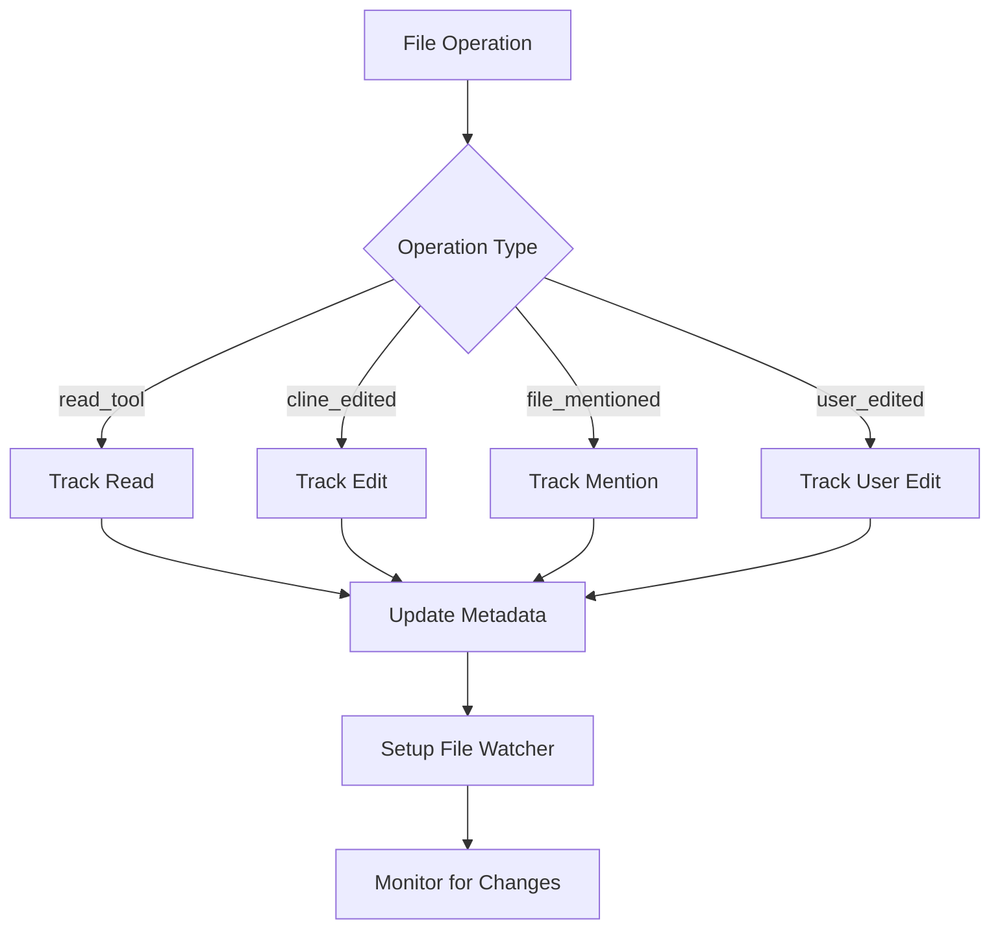
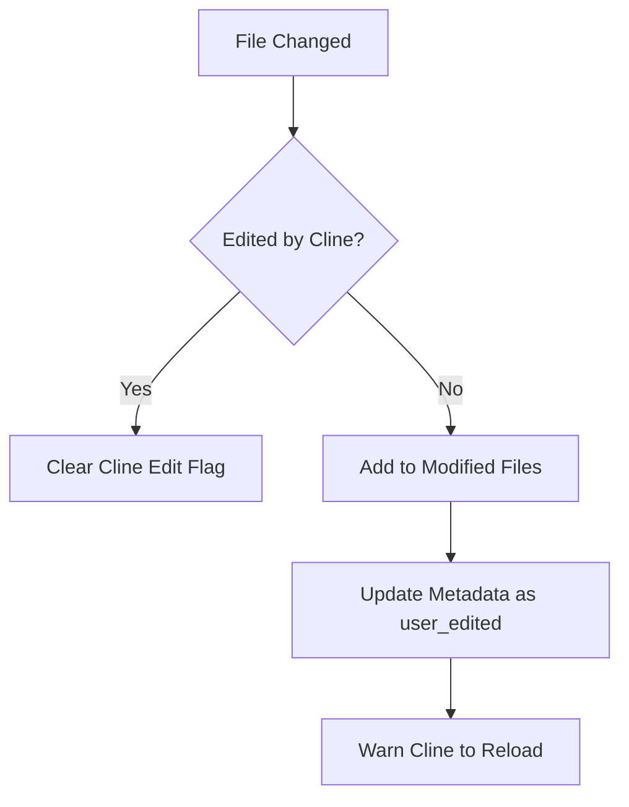
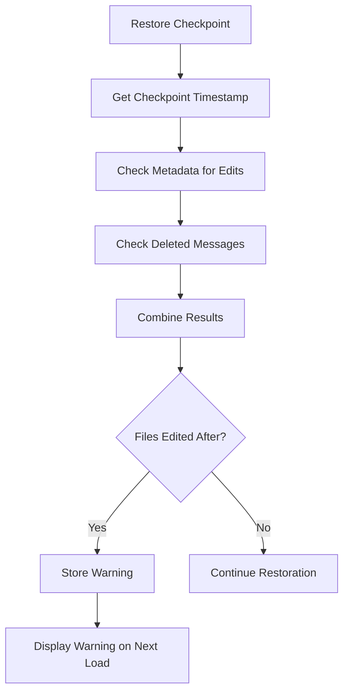

## 📚 Overview

The Context Tracking System monitors file operations and model usage to maintain accurate context state and prevent stale data issues. It uses a modular architecture where each component has a single, clear responsibility.

## 🎯 Core Objectives

1. **Prevent Stale Context**: Detect when files are modified outside of Cline
2. **Track File Operations**: Monitor reads, edits, and mentions across the task
3. **Support Checkpoints**: Identify files edited after specific timestamps
4. **Warn Users**: Persist warnings about potential context mismatches
5. **Track Model Usage**: Record which models are used during tasks

## 🏗️ Architecture

### Module Overview

```
file_context_tracker.ts         # Orchestrator - coordinates all modules
├── context_tracker_types.ts    # Shared type definitions
├── file_watcher.ts             # File system monitoring with chokidar
├── file_metadata_manager.ts    # Metadata persistence
├── file_state_detector.ts      # State detection (recently modified files)
├── checkpoint_detector.ts      # Checkpoint edit detection
├── warning_persistence.ts      # Warning storage in workspace state
└── ModelContextTracker.ts      # Model usage tracking (standalone)
```

### Separation of Concerns

Each module has a focused responsibility:

| Module | Responsibility | Key Methods |
|--------|---------------|-------------|
| **FileContextTracker** | Orchestrates the entire system | `trackFileContext()`, `setupFileWatcher()` |
| **FileWatcher** | Monitors file system changes | `setupWatcher()`, `dispose()` |
| **FileMetadataManager** | Manages metadata persistence | `addFileEntry()`, `getAllFileEntries()` |
| **FileStateDetector** | Tracks modification state | `getAndClearModifiedFiles()`, `markAsEditedByCline()` |
| **CheckpointDetector** | Detects checkpoint edits | `detectEditedFiles()`, `wasFileEditedAfter()` |
| **WarningPersistence** | Stores warnings | `storeWarning()`, `retrieveAndClearWarning()` |
| **ModelContextTracker** | Tracks model usage | `recordModelUsage()` |

## 🔄 Workflow

### 1. File Tracking Flow



### 2. File Change Detection



### 3. Checkpoint Restoration



## 📊 Data Structures

### File Metadata Entry

```typescript
interface FileMetadataEntry {
    path: string                 // Relative path from workspace
    record_state: "active" | "stale"
    record_source: FileOperation // How file entered context
    cline_read_date: number | null
    cline_edit_date: number | null
    user_edit_date: number | null
}
```

**State Lifecycle:**
1. **Active**: File is currently in context (most recent entry)
2. **Stale**: File was in context but superseded by newer entry

### Model Usage Entry

```typescript
interface ModelMetadataEntry {
    ts: number              // Timestamp
    model_id: string        // e.g., "claude-3-5-sonnet-20241022"
    model_provider_id: string  // e.g., "anthropic"
    mode: string           // e.g., "architect", "code"
}
```

## 🔍 Key Concepts

### File Operations

```typescript
type FileOperation = 
    | "read_tool"      // File read via read_file tool
    | "user_edited"    // User edited file outside Cline
    | "cline_edited"   // Cline edited the file
    | "file_mentioned" // File mentioned in user message
```

### Stale Context Detection

The system tracks three critical timestamps for each file:
- **cline_read_date**: When Cline last read the file
- **cline_edit_date**: When Cline last edited the file
- **user_edit_date**: When user last edited the file

**Stale Detection Logic:**
1. File watcher detects change
2. Check if change was by Cline (recently edited flag)
3. If not Cline → user edit → mark file for reload
4. Update metadata with user_edit_date
5. Inform Cline to reload before any edits

### Checkpoint Detection

When restoring a checkpoint:
1. Get checkpoint timestamp
2. Query metadata for files with edit dates > timestamp
3. Scan deleted messages for file operations
4. Combine results → unique file list
5. Store warning if any files found
6. Display warning on next task load

### Warning Persistence

Warnings are stored in VSCode workspace state with key format:
```
pendingFileContextWarning_${taskId}
```

**Why Workspace State?**
- Persists across VSCode restarts
- Survives task reinitialization
- Can be cleaned up when tasks are deleted

## 🚀 Usage Examples

### Track File Read

```typescript
const tracker = new FileContextTracker(controller, taskId)
await tracker.trackFileContext("src/app.ts", "read_tool")
```

### Mark File as Edited by Cline

```typescript
// Before Cline edits a file
tracker.markFileAsEditedByCline("src/app.ts")

// Make the edit...

// File watcher will ignore the change
```

### Get Recently Modified Files

```typescript
const modifiedFiles = tracker.getAndClearRecentlyModifiedFiles()
if (modifiedFiles.length > 0) {
    console.log("Files modified by user:", modifiedFiles)
    // Reload these files before editing
}
```

### Detect Checkpoint Edits

```typescript
const editedFiles = await tracker.detectFilesEditedAfterMessage(
    checkpointTimestamp,
    deletedMessages
)

if (editedFiles.length > 0) {
    await tracker.storePendingFileContextWarning(editedFiles)
}
```

### Retrieve and Display Warning

```typescript
const warning = await tracker.retrieveAndClearPendingFileContextWarning()
if (warning) {
    console.log("Files may have stale context:", warning)
    // Display warning to user
}
```

### Track Model Usage

```typescript
const modelTracker = new ModelContextTracker(taskId)
await modelTracker.recordModelUsage(
    "anthropic",
    "claude-3-5-sonnet-20241022",
    "architect"
)
```

## 🧪 Testing

### Running Tests

```bash
npm test src/core/context/context-tracking/
```

### Key Test Scenarios

1. **File Watcher Setup**: Verify watchers are created for tracked files
2. **State Detection**: Ensure Cline edits don't trigger false positives
3. **Metadata Management**: Confirm proper timestamp tracking
4. **Checkpoint Detection**: Test edit detection after timestamps
5. **Warning Persistence**: Verify warnings persist across sessions

## 📝 Common Scenarios

### Scenario 1: User Edits File While Cline is Working

```
1. Cline reads file.ts → tracked with read_tool
2. User edits file.ts externally
3. File watcher detects change
4. StateDetector confirms not a Cline edit
5. File added to modified files
6. Metadata updated with user_edit_date
7. Cline notified to reload before editing
```

### Scenario 2: Restoring Checkpoint After Edits

```
1. User creates checkpoint at T1
2. Cline edits file.ts at T2 (T2 > T1)
3. User restores checkpoint to T1
4. CheckpointDetector finds file.ts edited after T1
5. Warning stored in workspace state
6. On next task load, warning displayed
7. User can choose to reload file or continue
```

### Scenario 3: Diff Edit with Stale Context

```
OLD BEHAVIOR (Without Tracking):
1. Cline reads file.ts
2. User edits file.ts externally
3. Cline attempts diff edit
4. Edit fails due to stale context

NEW BEHAVIOR (With Tracking):
1. Cline reads file.ts → tracked
2. User edits file.ts externally → detected
3. File added to modified files
4. Before diff edit, Cline reloads file.ts
5. Edit succeeds with current content
```

## 🔧 Maintenance

### Adding New File Operation Types

1. **Update Types**:
```typescript
// context_tracker_types.ts
export type FileOperation = 
    | "read_tool" 
    | "user_edited" 
    | "cline_edited" 
    | "file_mentioned"
    | "new_operation" // Add here
```

2. **Update Metadata Manager**:
```typescript
// file_metadata_manager.ts
switch (operation) {
    // ... existing cases
    case "new_operation":
        entry.some_new_date = now
        break
}
```

3. **Track in Main Class**:
```typescript
// file_context_tracker.ts
await tracker.trackFileContext(filePath, "new_operation")
```

### Cleanup Orphaned Warnings

Called automatically on extension startup:

```typescript
// In extension activation
await FileContextTracker.cleanupOrphanedWarnings(context)
```

This removes warnings for tasks that no longer exist.

### Debugging

Enable detailed logging:

```typescript
// In FileContextTracker
console.log("Tracking file:", filePath, operation)
console.log("Modified files:", this.stateDetector.getModifiedFileCount())
console.log("Active watchers:", this.fileWatcher.getWatcherCount())
```

## 📚 Related Documentation

- [Task Metadata](../storage/disk.ts) - Metadata persistence
- [Controller](../../controller/index.ts) - State management
- [Checkpoints](../../../integrations/checkpoints/) - Checkpoint system

## 🙏 Contributing

When modifying the context tracking system:

1. **Follow Single Responsibility**: Each module does one thing well
2. **Use Descriptive Names**: No abbreviations, clear intent
3. **Add JSDoc Comments**: Document all public methods
4. **Write Tests**: Cover edge cases and error scenarios
5. **Update README**: Keep this document current

---

**Remember**: The goal is to prevent stale context issues by accurately tracking file state and warning users about potential mismatches.

