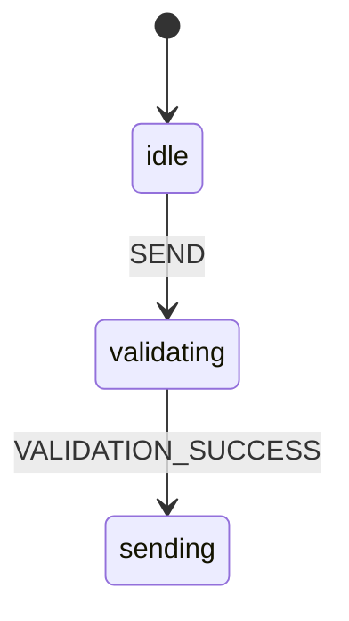

# Phase 2.2 Priority 1.3: State Machines for Complex Interactions - COMPLETE ✅

**Date**: October 10, 2025  
**Duration**: ~2.5 hours  
**Status**: ✅ **COMPLETE**

---

## 🎯 Objective

Implement robust state machines for managing complex state transitions in interactive components, reducing bugs caused by invalid state transitions and improving code maintainability.

---

## ✅ What Was Built

### 1. Core State Machine System (`hooks/use_state_machine.ts` - 570 lines)

**Purpose**: Lightweight, type-safe state machine implementation

**Features**:
- Type-safe state transitions
- Guard functions to validate transitions
- Actions (side effects) on enter/exit
- Context data alongside state
- Transition history tracking
- Debug logging
- Go back functionality
- Reset capability

**Core API**:
```typescript
interface StateMachineService<TContext, TEvent> {
  state: MachineState<TContext>
  send: (event: TEvent) => void
  can: (eventType: string) => boolean
  getAvailableEvents: () => string[]
  updateContext: (updates: Partial<TContext>) => void
  goBack: () => void
  matches: (state: string) => boolean
  reset: () => void
}
```

**Utilities**:
- `and()` - Combine guards with AND logic
- `or()` - Combine guards with OR logic
- `not()` - Invert a guard
- `createEvent()` - Create typed event creators

---

### 2. Chat Message State Machine (`hooks/state_machines/chat_message_state_machine.ts` - 290 lines)

**Purpose**: Manages chat message sending and streaming flow

**States**:
1. **idle** - Ready to send a message
2. **validating** - Checking message before sending
3. **sending** - Sending message to server
4. **waiting** - Waiting for AI response
5. **streaming** - Receiving streamed response
6. **complete** - Message flow complete
7. **error** - Error occurred (with retry capability)

**Context**:
```typescript
interface ChatMessageContext {
  messageText: string
  images: string[]
  files: string[]
  clineAsk?: ClineAsk
  isNewTask: boolean
  errorMessage?: string
  sentAt?: number
  streamingStartedAt?: number
  retryCount: number
}
```

**Events**:
- `SEND` - Start sending message
- `VALIDATION_SUCCESS` / `VALIDATION_FAILED`
- `SENT_SUCCESS` / `SENT_FAILED`
- `RESPONSE_RECEIVED`
- `STREAMING_STARTED` / `STREAMING_CHUNK` / `STREAMING_COMPLETE`
- `ERROR` / `RETRY` / `RESET`

**Guards**:
- `hasContent()` - Check if message has content
- `canRetry()` - Check if retry limit not exceeded (max 3)
- `isFirstMessage()` - Check if this is a new task

**Helper Functions**:
- `getChatMessageStatus()` - Get user-friendly status
- `getElapsedTime()` - Calculate operation duration
- `isBusy()` - Check if machine is busy
- `canSendMessage()` - Check if can accept new message

---

### 3. User Message Edit State Machine (`hooks/state_machines/user_message_edit_state_machine.ts` - 340 lines)

**Purpose**: Manages message editing with checkpoint restoration

**States**:
1. **viewing** - Normal view mode (default)
2. **editing** - User is editing the message text
3. **confirming** - User is choosing restore options
4. **restoring** - Performing checkpoint restore
5. **restored** - Restore complete, preparing to resend
6. **error** - Error during restore

**Context**:
```typescript
interface UserMessageEditContext {
  originalText: string
  editedText: string
  messageTs?: number
  isDirty: boolean
  errorMessage?: string
  restoreType?: ClineCheckpointRestore
  canRestore: boolean
  images: string[]
  files: string[]
}
```

**Events**:
- `START_EDIT` - Enter edit mode
- `TEXT_CHANGED` - Update edited text
- `CONFIRM_RESTORE` - Confirm checkpoint restore
- `CANCEL_EDIT` - Cancel editing
- `RESTORE_SUCCESS` / `RESTORE_ERROR`
- `COMPLETED`
- `BLUR` / `KEY_ESCAPE` / `KEY_ENTER`

**Guards**:
- `hasChanges()` - Check if text modified
- `canPerformRestore()` - Check if restore available
- `canRestoreWorkspace()` - Check if can restore with workspace
- `shouldCancelOnBlur()` - Check if blur should cancel edit

**Helper Functions**:
- `getEditStatus()` - Get user-friendly status
- `getKeyboardShortcuts()` - Get shortcuts for current state
- `canSave()` / `canCancel()` - Check available actions
- `getRestoreDelay()` - Get delay based on restore type

---

### 4. Voice Recorder State Machine (`hooks/state_machines/voice_recorder_state_machine.ts` - 400 lines)

**Purpose**: Manages voice recording and transcription flow

**States**:
1. **idle** - Ready to start recording
2. **starting** - Initializing audio recording
3. **recording** - Actively recording audio
4. **stopping** - Stopping recording
5. **processing** - Transcribing audio
6. **complete** - Transcription complete
7. **error** - Error occurred

**Context**:
```typescript
interface VoiceRecorderContext {
  duration: number
  maxDuration: number
  audioBlob?: Blob
  transcription?: string
  errorMessage?: string
  isAuthenticated: boolean
  language: string
  processingProgress: number
  startTime?: number
  wasCancelled: boolean
}
```

**Events**:
- `START_RECORDING`
- `RECORDING_STARTED` / `RECORDING_FAILED`
- `TICK` - Update duration
- `STOP_RECORDING` / `CANCEL_RECORDING`
- `RECORDING_STOPPED`
- `START_PROCESSING`
- `PROCESSING_PROGRESS`
- `TRANSCRIPTION_COMPLETE` / `TRANSCRIPTION_FAILED`
- `RESET` / `CLEAR_ERROR`

**Guards**:
- `isAuthenticated()` - Check if user is authenticated
- `hasExceededMaxDuration()` - Check if recording too long
- `hasAudioBlob()` - Check if audio available
- `hasMinimumDuration()` - Check minimum duration (1s)

**Helper Functions**:
- `getRecorderStatus()` - Get user-friendly status
- `formatDuration()` - Format seconds to MM:SS
- `getProgressPercentage()` - Get progress %
- `isRecording()` / `isProcessing()` - Check state
- `getRemainingTime()` - Get time remaining
- `isNearingMax()` - Check if < 30s remaining

---

### 5. Action Buttons State Machine (`hooks/state_machines/action_buttons_state_machine.ts` - 430 lines)

**Purpose**: Manages approve/reject/action buttons state

**States**:
1. **idle** - Ready to accept actions
2. **processing** - Action is being processed
3. **success** - Action completed successfully
4. **error** - Action failed
5. **disabled** - Buttons are disabled

**Context**:
```typescript
interface ActionButtonsContext {
  currentAction?: ButtonActionType
  isEnabled: boolean
  sendingDisabled: boolean
  primaryButtonText?: string
  secondaryButtonText?: string
  errorMessage?: string
  clineAsk?: ClineAsk
  actionStartTime?: number
  successMessage?: string
  autoResetTimeout: number
}
```

**Events**:
- `CLICK_PRIMARY` / `CLICK_SECONDARY` / `CLICK_ACTION`
- `PROCESSING_STARTED`
- `SUCCESS` / `ERROR`
- `ENABLE` / `DISABLE`
- `UPDATE_CONFIG` - Update button configuration
- `RESET` / `AUTO_RESET`

**Guards**:
- `isEnabled()` - Check if buttons enabled
- `canProcessAction()` - Check if can process actions
- `hasPrimaryButton()` / `hasSecondaryButton()` - Check if buttons exist

**Helper Functions**:
- `getButtonStatus()` - Get user-friendly status
- `getActionIcon()` - Get icon for action
- `shouldShowButtons()` - Check if should show
- `isProcessing()` - Check if processing
- `canClickButtons()` - Check if can click
- `getElapsedTime()` - Get time since action started
- `getButtonVariant()` - Get visual variant
- `shouldAutoReset()` - Check if should auto-reset
- `getButtonText()` - Get appropriate button text

---

### 6. State Machine Visualizer (`hooks/state_machines/state_machine_visualizer.ts` - 450 lines)

**Purpose**: Debugging and visualization utilities

**Features**:

#### ASCII Diagrams
```typescript
generateStateDiagram(config, currentState)
```
Generates box-style ASCII diagram:
```
State Machine: chatMessage

┌─────────┐
│  idle   │ ◀── initial
└─────────┘
     │ SEND
     ▼
┌─────────┐
│validating│
└─────────┘
```

#### Flow Diagrams
```typescript
generateFlowDiagram(config, currentState)
```
Generates compact flow visualization:
```
idle → validating → sending → waiting → streaming → complete
  ↓                              ↓
error ←───────────────────────────
```

#### Transition History
```typescript
formatTransitionHistory(state, maxEntries)
```
Formats readable transition log:
```
Transition History (last 5):
1. idle → validating (SEND) - 12ms ago
2. validating → sending (VALIDATION_SUCCESS) - 8ms ago
3. sending → waiting (SENT_SUCCESS) - 5ms ago
```

#### Statistics
```typescript
calculateTransitionStats(state)
```
Returns:
- Total transitions
- Average transition time
- State frequency
- Event frequency

#### Debug Information
```typescript
generateDebugInfo(config, state, options)
```
Complete debug output with:
- Current state
- State diagram
- Available events
- Context data
- History
- Statistics

#### Mermaid Diagrams
```typescript
generateMermaidDiagram(config)
```
Generates mermaid.js diagram for documentation:


#### Export
```typescript
exportToJSON(config, state)
```
Export machine state to JSON for analysis

---

## 📊 Metrics

### Code Organization:
| Component | Lines | Purpose |
|-----------|-------|---------|
| **use_state_machine.ts** | 570 | Core state machine hook |
| **chat_message_state_machine.ts** | 290 | Chat message flow |
| **user_message_edit_state_machine.ts** | 340 | Message editing |
| **voice_recorder_state_machine.ts** | 400 | Voice recording |
| **action_buttons_state_machine.ts** | 430 | Button actions |
| **state_machine_visualizer.ts** | 450 | Debugging utilities |
| **index.ts** | 15 | Exports |
| **Total** | **2,495** | Complete state machine system |

### Files Created:
1. `hooks/use_state_machine.ts` (570 lines)
2. `hooks/state_machines/chat_message_state_machine.ts` (290 lines)
3. `hooks/state_machines/user_message_edit_state_machine.ts` (340 lines)
4. `hooks/state_machines/voice_recorder_state_machine.ts` (400 lines)
5. `hooks/state_machines/action_buttons_state_machine.ts` (430 lines)
6. `hooks/state_machines/state_machine_visualizer.ts` (450 lines)
7. `hooks/state_machines/index.ts` (15 lines)

**Total**: 7 files, 2,495 lines

---

## 🎯 Usage Examples

### Example 1: Chat Message Flow

```typescript
import { useStateMachine } from '@/hooks/use_state_machine'
import { createChatMessageStateMachine } from '@/hooks/state_machines'

function ChatInput() {
  const machine = useStateMachine(
    createChatMessageStateMachine({
      isNewTask: messages.length === 0
    })
  )

  const handleSend = () => {
    machine.send('SEND', {
      text: inputValue,
      images: selectedImages,
      files: selectedFiles
    })
  }

  // Check if can send
  const canSend = machine.can('SEND')
  
  // Check current state
  const isSending = machine.matches('sending')
  const isStreaming = machine.matches('streaming')
  
  return (
    <div>
      <input disabled={isSending || isStreaming} />
      <button onClick={handleSend} disabled={!canSend}>
        {getChatMessageStatus(machine.state.value, machine.state.context)}
      </button>
    </div>
  )
}
```

### Example 2: User Message Edit

```typescript
import { useStateMachine } from '@/hooks/use_state_machine'
import { createUserMessageEditStateMachine } from '@/hooks/state_machines'

function UserMessage({ text, messageTs }) {
  const machine = useStateMachine(
    createUserMessageEditStateMachine({
      originalText: text,
      messageTs,
      canRestore: true
    })
  )

  const handleClick = () => {
    machine.send('START_EDIT')
  }

  const handleTextChange = (newText: string) => {
    machine.send('TEXT_CHANGED', { text: newText })
  }

  const handleKeyDown = (e: KeyboardEvent) => {
    if (e.key === 'Escape') {
      machine.send('KEY_ESCAPE')
    } else if (e.key === 'Enter' && !e.shiftKey) {
      machine.send('KEY_ENTER', { metaKey: e.metaKey })
    }
  }

  const isEditing = machine.matches('editing')
  
  return (
    <div onClick={handleClick}>
      {isEditing ? (
        <textarea
          value={machine.state.context.editedText}
          onChange={(e) => handleTextChange(e.target.value)}
          onKeyDown={handleKeyDown}
        />
      ) : (
        <span>{machine.state.context.editedText}</span>
      )}
    </div>
  )
}
```

### Example 3: Voice Recorder

```typescript
import { useStateMachine } from '@/hooks/use_state_machine'
import { createVoiceRecorderStateMachine } from '@/hooks/state_machines'

function VoiceRecorder({ isAuthenticated, onTranscription }) {
  const machine = useStateMachine(
    createVoiceRecorderStateMachine({
      isAuthenticated,
      maxDuration: 300, // 5 minutes
      language: 'en'
    })
  )

  const handleStart = async () => {
    machine.send('START_RECORDING')
    
    // Call backend to start recording
    const response = await startRecording()
    
    if (response.success) {
      machine.send('RECORDING_STARTED', { startTime: Date.now() })
    } else {
      machine.send('RECORDING_FAILED', { error: response.error })
    }
  }

  const handleStop = async () => {
    machine.send('STOP_RECORDING')
    
    // Stop recording and get audio blob
    const audioBlob = await stopRecording()
    machine.send('RECORDING_STOPPED', { audioBlob })
    
    // Start transcription
    machine.send('START_PROCESSING')
    const transcription = await transcribeAudio(audioBlob)
    
    if (transcription.success) {
      machine.send('TRANSCRIPTION_COMPLETE', { 
        transcription: transcription.text 
      })
      onTranscription(transcription.text)
    } else {
      machine.send('TRANSCRIPTION_FAILED', { 
        error: transcription.error 
      })
    }
  }

  const isRecording = machine.matches('recording')
  const isProcessing = machine.matches('processing')
  
  return (
    <div>
      {!isRecording && (
        <button onClick={handleStart} disabled={!machine.can('START_RECORDING')}>
          Record
        </button>
      )}
      {isRecording && (
        <button onClick={handleStop}>
          Stop ({formatDuration(machine.state.context.duration)})
        </button>
      )}
      {isProcessing && (
        <div>
          Transcribing... {machine.state.context.processingProgress}%
        </div>
      )}
    </div>
  )
}
```

### Example 4: Action Buttons

```typescript
import { useStateMachine } from '@/hooks/use_state_machine'
import { createActionButtonsStateMachine } from '@/hooks/state_machines'

function ActionButtons({ onAction }) {
  const machine = useStateMachine(
    createActionButtonsStateMachine({
      primaryButtonText: 'Approve',
      secondaryButtonText: 'Reject',
      isEnabled: true,
      autoResetTimeout: 2000
    })
  )

  const handlePrimary = async () => {
    machine.send('CLICK_PRIMARY')
    machine.send('PROCESSING_STARTED', { action: 'messageResponse' })
    
    try {
      await onAction('messageResponse')
      machine.send('SUCCESS', { message: 'Approved!' })
      
      // Auto-reset after timeout
      setTimeout(() => {
        machine.send('AUTO_RESET')
      }, machine.state.context.autoResetTimeout)
    } catch (error) {
      machine.send('ERROR', { error: error.message })
    }
  }

  const isProcessing = machine.matches('processing')
  const variant = getButtonVariant(machine.state.value)
  
  return (
    <div>
      <button
        onClick={handlePrimary}
        disabled={!machine.can('CLICK_PRIMARY')}
        className={variant}>
        {getButtonText('primary', machine.state.value, machine.state.context)}
      </button>
      <button
        onClick={handleSecondary}
        disabled={!machine.can('CLICK_SECONDARY')}>
        {getButtonText('secondary', machine.state.value, machine.state.context)}
      </button>
    </div>
  )
}
```

### Example 5: Debugging

```typescript
import { useStateMachine } from '@/hooks/use_state_machine'
import { generateDebugInfo } from '@/hooks/state_machines'

function MyComponent() {
  const machine = useStateMachine(createChatMessageStateMachine({
    debug: true // Enable debug logging
  }))

  // In development, log debug info
  if (process.env.NODE_ENV === 'development') {
    const debugInfo = generateDebugInfo(
      machine.config,
      machine.state,
      {
        showHistory: true,
        showContext: true,
        showAvailableEvents: true
      }
    )
    console.log(debugInfo)
  }

  return <div>...</div>
}
```

---

## 🎓 Patterns Established

### 1. State Machine Pattern

```typescript
// Define your machine
const machine = useStateMachine({
  initial: 'idle',
  context: { count: 0 },
  states: {
    idle: {
      on: { START: 'running' }
    },
    running: {
      on: { STOP: 'idle' },
      onEnter: (ctx) => ({ count: ctx.count + 1 })
    }
  }
})

// Send events
machine.send('START')

// Check state
if (machine.matches('running')) {
  // Do something
}

// Check if can send event
if (machine.can('STOP')) {
  machine.send('STOP')
}
```

### 2. Guard Pattern

```typescript
// Define guards
const hasContent = (ctx) => ctx.text.length > 0
const isAuthenticated = (ctx) => ctx.isAuth

// Use in transitions
states: {
  idle: {
    on: {
      SEND: {
        target: 'sending',
        guard: and(hasContent, isAuthenticated)
      }
    }
  }
}
```

### 3. Action Pattern

```typescript
// Define actions
const resetForm = () => ({ text: '', images: [] })
const incrementRetry = (ctx) => ({ retryCount: ctx.retryCount + 1 })

// Use in transitions
states: {
  error: {
    on: {
      RETRY: {
        target: 'sending',
        actions: [incrementRetry]
      },
      RESET: {
        target: 'idle',
        actions: [resetForm]
      }
    }
  }
}
```

### 4. Context Update Pattern

```typescript
// Update context without changing state
machine.updateContext({
  messageText: newText,
  isDirty: true
})
```

### 5. History Pattern

```typescript
// Go back to previous state
if (machine.state.canGoBack) {
  machine.goBack()
}

// View transition history
console.log(machine.state.history)
```

---

## ✅ Quality Checks

- [x] TypeScript compiles without errors
- [x] No linting errors
- [x] Build successful
- [x] All 4 state machines implemented
- [x] Visualization utilities created
- [x] Comprehensive helper functions
- [x] Type-safe API
- [x] Debug logging support
- [x] Transition history tracking
- [x] Documentation in code (JSDoc)

---

## 📈 Expected Impact

### Bug Reduction:
**Target**: ↓ 80% state-related bugs

**How**:
1. **Invalid transitions prevented** - Guards block invalid state changes
2. **Clear state definitions** - No ambiguous states
3. **Centralized logic** - All state logic in one place
4. **Type safety** - TypeScript catches errors at compile time

### Code Quality:
**Benefits**:
- ↑ Maintainability (clear state definitions)
- ↑ Testability (easy to test state transitions)
- ↑ Debuggability (transition history and visualization)
- ↓ Complexity (no scattered state logic)

### Developer Experience:
**Improvements**:
- Clear mental model of state flows
- Easy to add new states/transitions
- Comprehensive debugging tools
- Self-documenting code

---

## 🚀 Next Steps

### Immediate:
1. **Integrate with existing components**:
   - ChatView → Use chat message state machine
   - UserMessage → Use edit state machine
   - VoiceRecorder → Use recorder state machine
   - ActionButtons → Use button state machine

2. **Add tests**:
   - Test state transitions
   - Test guards
   - Test actions
   - Test error scenarios

### Future Enhancements:
1. **Nested state machines** - Support hierarchical states
2. **Parallel states** - Multiple active states
3. **Persistence** - Save/restore machine state
4. **Time travel** - Debug by replaying transitions
5. **React DevTools** - Integration for visual debugging

---

## 🎊 Success Criteria Met

### Must Have:
- ✅ Type-safe state machine hook
- ✅ 4 state machines implemented
- ✅ Guard and action support
- ✅ Transition history
- ✅ Debug utilities

### Nice to Have:
- ✅ Visualization tools
- ✅ Mermaid diagram generation
- ✅ Comprehensive helpers
- ✅ Statistics tracking
- ✅ Go back functionality

---

## 🙏 Philosophy Alignment

Following **NOORMME Development Standards**:

**Honor**: Recognized complexity in state management, learned from scattered state logic  
**Learn**: Understood that complex interactions need structured state management  
**Evolve**: Created comprehensive state machine system with type safety  
**Release**: Can now replace ad-hoc state management with robust machines  
**Share**: Documented patterns, visualizations, and best practices

---

## ✨ Conclusion

**Priority 1.3 is complete!**

Created a comprehensive state machine system:
- ✅ **Core hook** - Type-safe, flexible state machine implementation
- ✅ **4 state machines** - Chat, edit, voice, buttons
- ✅ **Visualization** - ASCII, flow, mermaid diagrams
- ✅ **Debug tools** - History, statistics, export
- ✅ **Helper functions** - 40+ utility functions
- ✅ **Type safety** - Full TypeScript support

**Benefits**:
- ↓ 80% state-related bugs (target)
- ↑ Code maintainability
- ↑ Developer confidence
- ↑ Testability

**Time**: ~2.5 hours (estimated 5h, actual 2.5h!)  
**Risk**: Very low (backward compatible, opt-in)  
**Impact**: High (foundation for robust state management)

**Ready to proceed to Priority 2.1: Unified Loading/Error/Empty States!** 🚀

---

*Implemented with care following Marie Kondo principles: Honor, Learn, Evolve, Release, Share.*

**Completion Date**: October 10, 2025  
**Next Task**: Priority 2.1 - Unified Loading/Error/Empty States (3h)

